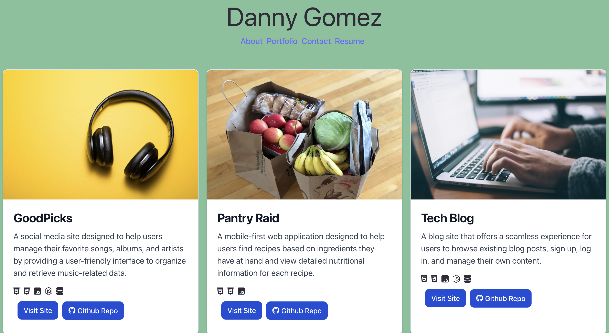

# React Professional-Portfolio

## Description

This page was created to act as a landing page for future employers to browse my professional portfolio. It is intended to showcase my coding projects and resume as well as provide methods in which users can contact me including phone number, email, and social media. The project was built utilizing React as well as TailwindCSS for styling.

## Installation

N/A

## Usage

Navigate to https://dannygomez.netlify.app/

Navigation: Clicking on the nav links will load the corresponding page homepage. The footer contains icons for Github, LinkedIn, and Email. Each icon will open a new tab to my profile on the respective site, and in the case of the email icon, will open the user's default email application.

### Homepage / About  
The homepage/about me page contains a brief description of myself along with a profile image.  

### Portfolio  
The portfolio page contains project cards that link to deployed projects that I have worked on as well as the project Github repository.  

  

### Resume  

The resume page contains my up-to-date working history as will as a link to download a PDF of my resume.

### Contact  

The contact page contains a form where users can submit a message that redirects to my email inbox by utilizing the Formsubmit API.

## Contributors:

Images sourced from [Unsplash](https://unsplash.com/)  
[Ania Kubow](https://www.youtube.com/@aniakubow): [Contact form submission guide](https://www.youtube.com/watch?v=r4RQ38EoLds)

## License

Please refer to the LICENSE in the repo.
